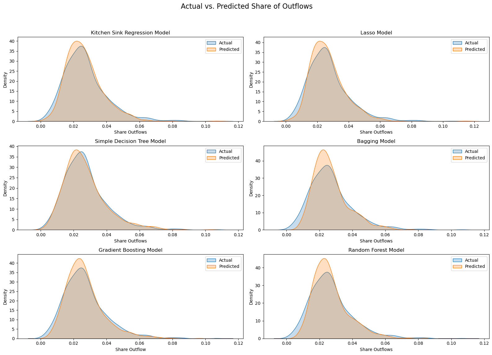

### Understanding Migration Patterns in the United States After the Pandemic

### Problem Statement

The COVID-19 pandemic drastically altered how people live and work, leading to widespread remote work and a noticeable shift in migration patterns. Many urban residents relocated to suburban or rural areas, reshaping the population distribution across the U.S. Our project aimed to answer the question: **What factors are most predictive of county-level migration patterns after COVID-19 in the United States?** Specifically, we investigated the socio-economic and demographic variables that influenced out-migration from U.S. counties, such as housing market trends, educational facilities, diversity, and COVID-19 preparedness.

### Methodology

We relied on two primary datasets:

1. **IRS Statistics of Income (SOI) Tax Migration Data**: This dataset tracked migration flows between U.S. counties, offering insights into where people were moving and from which counties they were leaving.
2. **Kaggle Socio-Economic Dataset (2019 and 2021)**: This dataset contained detailed demographic, health, and COVID-19 data at the county level, allowing for a multi-dimensional analysis of the factors driving migration.

Key data points included:
- **Migration Outflows**: The share of a county's population that moved out during the study period.
- **Log Adjusted Gross Income (AGI)**: The financial status of those leaving the counties.
- **Homeownership Rates**: Proportion of homeowners in each county.
- **COVID-19 Preparedness**: Hospital availability and health infrastructure readiness.
  
#### Exploratory Data Analysis (EDA)

We began with a thorough EDA to explore trends and relationships between the variables:
- **Migration Patterns**: The majority of counties had low out-migration rates, but certain counties showed disproportionately high migration, prompting further investigation.
- **AGI and Migration**: A positive correlation was observed between the log of AGI for leavers and the share of outflows, suggesting that wealthier residents were more likely to migrate.
- **Homeownership**: Counties with higher homeownership rates tended to have slightly lower out-migration, although this relationship was not uniform across all counties.
- **Outliers**: A number of counties showed extreme values for out-migration or AGI, indicating unique socio-economic circumstances that warranted closer inspection.

### Approach

To predict county-level migration patterns, we trained six machine learning models and evaluated their performance:
1. **Kitchen Sink Regression**: A baseline linear regression model using all variables.
2. **Lasso Regression**: A regularization technique to handle multicollinearity and reduce overfitting.
3. **Decision Trees**: A non-linear approach to capture complex interactions between variables.
4. **Bagging**: An ensemble method to reduce variance by combining multiple decision trees.
5. **Boosting**: An iterative technique to improve model accuracy by focusing on misclassified instances.
6. **Random Forest**: A robust ensemble method that averaged multiple decision trees to minimize overfitting and improve accuracy.

### Results: Model Comparison

In general, all models seem to perform reasonably well, with no clear pattern of residuals that would indicate bias. Some models, like the Gradient Boosting and Random Forest, appear to have better performance due to the more uniform spread of residuals, which suggests a consistent predictive performance across the range of predicted values. However, the slight funnel shapes in some plots imply that the variance of errors may be increasing with predicted values, which is a phenomenon known as heteroscedasticity. This could be improved potentially by transforming the target variable or applying variance-stabilizing techniques.

#### Techniques Used:
- **Cross-Validation**: To ensure model reliability, we used cross-validation to tune hyperparameters for each model, such as maximum depth for decision trees and the number of bootstraps for bagging.
- **Grid Search**: For boosting and random forests, we employed grid search to find the optimal parameters for learning rate, number of estimators, and depth.
- **Feature Importance**: We generated feature importance plots for the tree-based models, enhancing the interpretability of the results.

### Findings

After splitting the dataset into an 80:20 train-test ratio, we assessed the models based on their **Mean Squared Error (MSE)** and **R² scores**:

- **Random Forest** outperformed all other models, achieving the lowest test MSE (0.000025) and the highest R² (0.853828), indicating that this model captured the most variance and provided the most accurate predictions.
- **Bagging** and **Boosting** models also showed strong performance, with test MSEs of 0.000029 and 0.000039, respectively, and R² scores above 0.77.
- The baseline models (Kitchen Sink and Lasso) performed adequately, but their lower R² scores (~0.67) suggested they were less effective at capturing complex relationships between variables.

#### Key Predictors:
- **Population Density**: The most significant predictor of out-migration. Counties with higher population densities saw more pronounced out-migration, likely driven by the shift to remote work and the desire for less crowded living conditions.
- **AGI of Leavers**: Wealthier individuals were more likely to leave urban areas, possibly seeking lower cost of living or more space in suburban or rural regions.
- **Homeownership Rates**: Higher homeownership rates were associated with lower migration, indicating that residents with a more permanent investment in their homes were less likely to move.

### Technical Acumen and Impact

This project demonstrated our strong technical grasp of advanced machine learning techniques, including:
- **Hyperparameter Tuning**: By fine-tuning models using cross-validation and grid search, we improved model performance and reduced overfitting.
- **Ensemble Methods**: Utilizing ensemble techniques like **Bagging**, **Boosting**, and **Random Forests** significantly enhanced predictive accuracy over traditional linear models.
- **Feature Importance Analysis**: This helped identify the most influential variables, adding transparency to the predictive process and informing future decision-making.
  
### Practical Applications

The findings from this project have potential real-world applications in:
1. **Policy Making**: Governments can use these insights to craft targeted policies that address migration trends, ensuring that infrastructure and services meet shifting population needs.
2. **Urban Planning**: Understanding the factors driving out-migration can help urban planners improve livability in cities by addressing issues like housing affordability and public health.
3. **Economic Development**: Counties experiencing high out-migration can develop strategies to retain residents or attract new populations, focusing on factors like economic opportunities, education, and healthcare.

